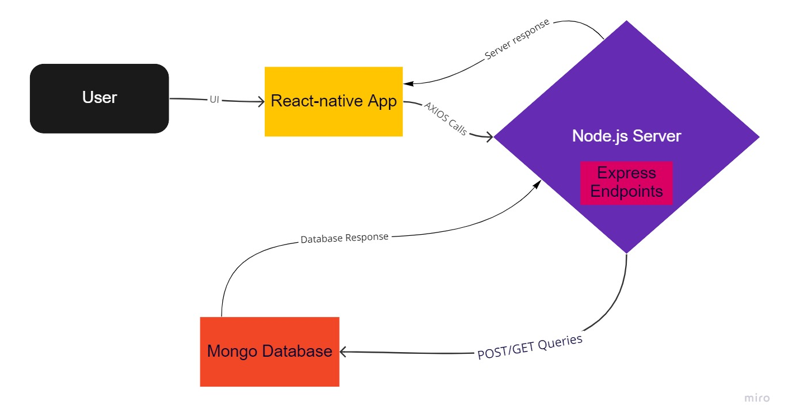

# START Data
A MERN based full stack mobile application for START project data entry.

## Features
- User login authentication and signup. 
- Generic data entry form modifiable through a json file `fields.json` where fields can be added or removed without any modifications to the codebase.
- Image upload with a data entry about a reptile that is displayed every time the entry is shown later through lookup or saved entries on disk.
- Guest Mode that isn't allowed to submit data to the server but can save to phone disk and access them later on the same device in normal mode for submission.
- Search functionality based on category and other criteria specified in a json file `search.json` where fields can be added or removed without any modification to the codebase. 

## Components

- React-native based front-end user interface, making axios calls to the server on user data entry submissions and searches.
- Local Mongo Database storing collections of user login credentials, reptile information and images.
- Node.js server with express.js endpoints querying the database and responding to the axios calls made by the react-native app.

## Fields.json Format
`fields.json` is located at [./app/utils/fields.json](./app/utils/fields.json). It specifies all the fields which the `Data Entry` screen is dependent on. To modify the `fields.json` file a specific format must be followed:
```json
[
    {
        "Category": "required string",
        "ConditionalFields":  [
            {
                "name": "required string",
                "dropdown": true,
                "values": ["string", "string"],
                "dataValidation": {
                    "isNumber": false,
                    "arguments": "input",
                    "body": "return input > 4;",
                    "error": "Data validation condition failed."
                },
                "ConditionalFields": []
            }
        ]
    }
]
```
- Only the `Category` field in each of the main objects and the `name` in each conditional field is required. 
- Adding a new object with a `Category` and `ConditionalFields` will create a new button at the top next to `Turtle`, `Snake` etc. and selecting that will render all the fields in the `All` category and that new object you created.
- You can nest `ConditionalFields` as shown above.
- `dataValidation` element is a function that gives the user an error when Submitting data to the server or Saving using the validated `Save` button from data entry, `Quick Save` doesn't use data validation.
    * arguments: should just be one taking in the value entered in the field or selected in the dropdown.
    * body: the condition that the data must meet to pass the data validation.
    * error: error message given to the user in case the condition isn't met.
    * isNumber: boolean indicating if the value is a number or not.

