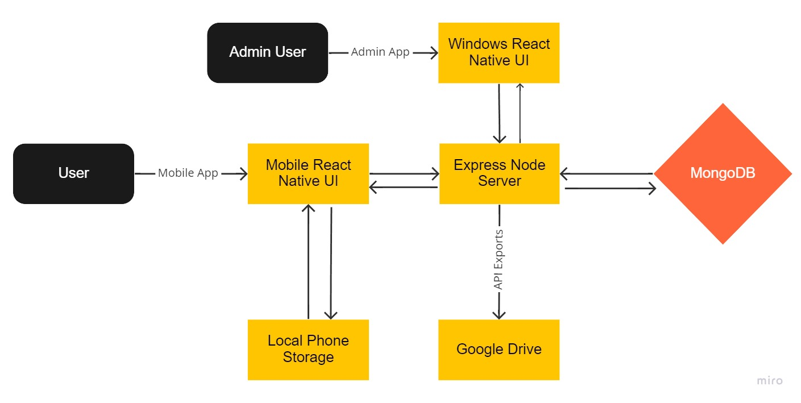

# Data Entry App
A MERN based data entry system that consists of a mobile data entry app and an administrator windows app for managing user credentials and data entry features.

## Contributing
Please read our [CONTRIBUTING.md](CONTRIBUTING.md) to learn about our development process, how to propose bug fixes and improvements, and how to join us in the development of this project.

## Features
- A Generic data entry form modifiable through the `fields` collection in the mongo database.
- A search functionality that allows users to query data entries based on specified criteria.
- An export functionality that allows users to export single or groups of data entries into a google drive shareable folder with  

## Components

- React-native based mobile & windows desktop interfaces, making http requests to the server on user interactions. Check [app readme](./app/README.md) for more information on the mobile app and [admin readme](./admin/README.md) for more information on the admin app.
- Local Mongo Database storing collections of login credentials, submitted & shared data entries, data entry images and data entry fields.
- Node.js server with express.js endpoints querying the database and responding to the http requests made by the apps. Check [server readme](./server/README.md).

## Dynamic Components
The system uses a set of JSON files and database collections to dynamically execute required tasks.  

## Fields
`fields.json` is located at [./app/utils/json/fields.json](./app/utils/json/fields.json) for the mobile app and [./admin/utils/json/fields.json](./admin/utils/json/fields.json) for the admin app. It specifies all the fields which the `Data Entry` screen is dependent on. 

This file is the secondary source for data entry fields and is statically pushed with the app releases. The primary source is the `fields` collection in the START-Project database on our mongo deployment. The fields collection can be updated manually through the database or through the admin app to change the displayed fields in the data entry screens on both apps.

Changing the fields doesn't affect old submitted data in the database but hides the deleted fields when searched from the mobile app or entry is opened in the admin app. Exporting the data to google drive will include all hidden fields.

#### Format: 
```json
[
    {
        "Category": "required string", // "All" makes fields appear under any category
        "conditionalFields":  [
            {
                "name": "required string", 
                "dropDown": true,
                "values": ["string", "string"], // undefined if !dropDown
                "initId": 0, // index of default value from values list
                "autoFill": {
                    "dependencies": [
                            "dependent field 1 name", 
                            "dependent field 2 name",
                            "etc."
                    ],
                    "arguments": "dependencies", // above array is argument
                    "body": "return <expression using dependencies argument>;"
                },
                "dataValidation": {
                    "isNumber": false, // true || false
                    "arguments": "input",
                    "body": "return <expression using input>;",
                    "error": "string" // error message if returned false
                },

                // supports nested conditional fields
                "conditionalFields": [ 
                    {
                        "condition": "required string",
                        "name": "required string",
                        "dropDown": false,
                        "defaultValue": "string", // dropDown == false, initialValue
                        "autoFill": {...},
                        "dataValidation": {...}
                    }
                ] 
            }
        ]
    }
]
```
- Only the `Category` field in each of the main objects and the `name` in each conditional field is required. 
- Adding a new object with a `Category` and `ConditionalFields` will create a new button at the top next to `Turtle`, `Snake` etc. and selecting that will render all the fields in the `All` category and that new object you created.
- `initId` is the default index for dropdown menus and `defaultValue` is the default string for text inputs. 
    * These defaults are used only on fresh entries. 
    * Opening a saved, shared or submitted entry will not display the defaults even if that field was saved as empty.
- You can nest `conditionalFields` as shown above.
    * Nested conditional fields won't show the conditional field unless the parent has the `condition` value.
- `dataValidation` element is a function that gives the user an error when Submitting data to the server or Saving using the validated `Save` button from data entry, `Quick Save` doesn't use data validation.
    * arguments: should just be one taking in the value entered in the field or selected in the dropdown.
    * body: the condition that the data must meet to pass the data validation.
    * error: error message given to the user in case the condition isn't met.
    * isNumber: boolean indicating if the value is a number or not.
- `autoFill` element is a function that takes an array of dependencies specified by their field names and returns a value resultant from the return expression.

## Search.json
`search.json` is located at [./app/utils/json/search.json](./app/utils/json/search.json). It specifies all the search criteria fields which the `Search` screen is dependent on.

#### Format:
```json
[
    {
        "Category": "required string",
        "ConditionalFields":  [
            {
                "name": "required string",
                "dropdown": true,
                "values": ["string", "string"],
                "Subfields": [
                    {
                        "name": "required string",
                        "dropdown": false
                    }
                ] 
            }
        ]
    }
]
```
- Similar to the `fields.json` each object added to the main list, its category name is added to the category buttons at the top except the object with name == "All". Conditional criteria under the 'All' category will be displayed no matter which button is selected at the top.
- For each object added to the conditional criteria lists a new option in the search criteria dropdowns is made with the name element and the Subfields are displayed under the dropdown on selection. 
- Subfields are not required and if not specified, the screen displays a single "sub field" under the dropdown for the selected field inheriting the name of the parent field.

## License
This project is MIT licensed, as found in the [LICENSE](./LICENSE) file.